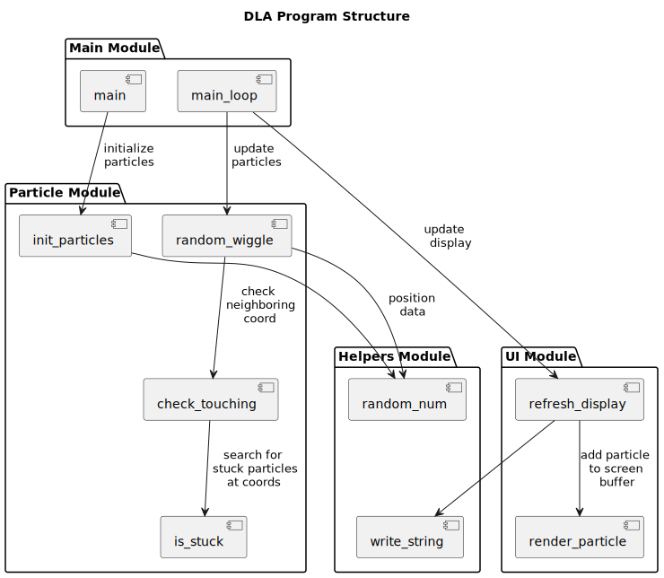

# DLA (Diffusion-Limited Aggregation) in Assembly 

<!-- GIF Image -->

  

## Overview
Diffusion-Limited Aggregation is an algorithm builds complex organic branching structures by diffusion. It mirrors effects seen in structures like mineral deposits and crystal dendrites, and can also be used in generative artwork.

Brownian Tree versions uses particles that randomly "wiggle" until they touch and stick to a larger structure of particles. This grows the structure as particles interact with it, diffusing it through the space. This project implements a version of DLA in assembly code.

## Modules
The program is organized into different modules:

<!-- SVG Image -->

  

### Main Module

  - `void main()`: Initializes the program, loops and updates each particle, then refreshes the display

### Particle Module

  - `void init_particles()`: Initialize all of the particles starting position and status
    - All particles all start with status unstuck (0)
    - Set a particle status to stuck (1) to control the aggregate growth point
  - `void random_wiggle()`: Moves the particle until it sticks to the aggregate structure
  - `bool check_touching(particle_index)`: Checks each neighboring coord (up, down, left, right)
  - `bool is_stuck(x, y)`: Searches for an stuck particles at the given coords

### UI Module

  - `void refresh_display()`: Refreshes the display with an updated screen buffer
  - `void render_particle(particle_index)`: Adds a particle and its status to the screen buffer

### Helpers Module

  - `int random_num(max_range)`: Generates random numbers
  - `void write_string(string)`: Writes a string into the console output

## Stretch Goal

- Add user controls: repeat with seed in center, repeat with seeds on bottom row